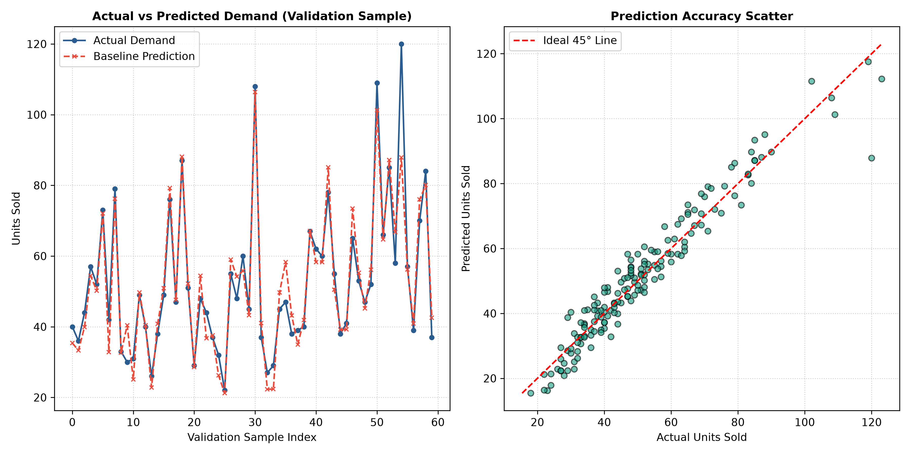

# GreenLeaf Grocery - Baseline Model Evaluation Report

**Task:** Task 2 - Develop baseline forecasting model and report
**Intern:** Mushtaq Ahmad
**Client:** GreenLeaf Grocery – Neighborhood Organic Market
**Algorithm:** Multiple Linear Regression with Scaled Numerical Features & One-Hot Encoding

---

## 1. Executive Summary

This report establishes the quantitative **baseline benchmark** for predicting daily perishable goods demand
across 12 produce SKUs at GreenLeaf Grocery. The baseline model serves as the reference threshold
against which future feature engineering and ensemble algorithms (Task 3) will be evaluated.

---

## 2. Data Splits & Preparation

| Split | Number of Rows | Percentage | Role |
|---|---|---|---|
| **Training Set (`train.csv`)** | 772 | 70% | Used strictly to learn scaling parameters |
| **Validation Set (`val.csv`)** | 166 | 15% | Held-out set used strictly for metric evaluation |
| **Test Set (`test.csv`)** | 166 | 15% | Reserved for final out-of-sample model assessment |

- **Numerical Features Scaled:** `unit_price`, `inventory_level` (StandardScaler fit on train only).
- **Categorical Features Encoded:** `category`, `promotion`, `is_weekend`, `sku_id` (One-hot encoded).

---

## 3. Baseline Model Performance Metrics

The baseline model was evaluated on the unseen validation dataset:

| Metric | Value | Interpretation |
|---|:---:|---|
| **Mean Absolute Error (MAE)** | **4.03 units** | Average deviation from actual demand. |
| **Root Mean Squared Error (RMSE)** | **5.33 units** | Penalizes larger forecasting errors. |

---

## 4. Visual Analysis: Predicted vs. Actual Demand

### Observations:
1. **Trend Capture:** The baseline model captures general SKU volume differences.
2. **Variance Limitation:** Linear Regression under-predicts demand spikes during weekend promotions.
3. **Target for Task 3:** Task 3 will introduce lag features and Gradient Boosting to reduce MAE by >= 10%.

---

## 5. Artifact Verification Checklist

- [x] Model serialized with joblib: `baseline_model.joblib`
- [x] Evaluation script outputs MAE and RMSE
- [x] Plot generated: `reports/figures/predicted_vs_actual.png`
- [x] Report generated: `baseline_report.md`
- [x] Pytest test suite passing: `tests/test_baseline.py`
